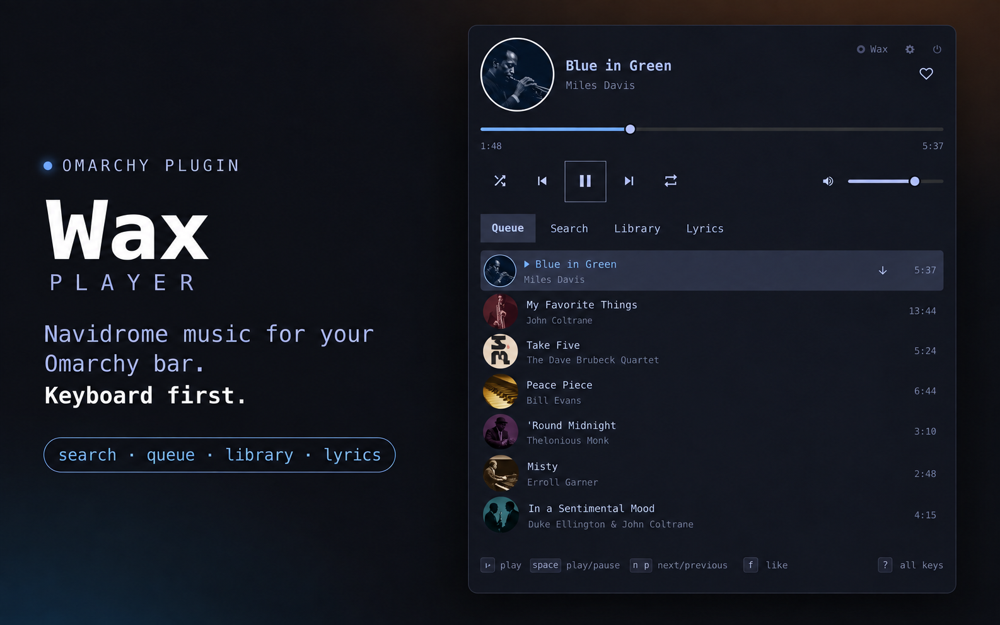

# Wax Player



*Promotional mockup; illustrative artwork and sample queue.*

**Wax Player is a Navidrome fork of [Solfa](https://github.com/sirallap/omarchy-solfa),
SirAllap's YouTube Music player for the Omarchy shell.** It brings your own
music library into the bar, with a keyboard-friendly panel for browsing,
searching, and playback.

This fork started from Solfa 1.0.2. It keeps the bar widget, panel, and much
of the original QML interface, while replacing the YouTube Music integration
with a Python backend that talks to Navidrome and plays audio through mpv.
Wax is a separate project with its own name, plugin identity, and saved data.

The full app name is **Wax Player**; the bar label is **Wax** and the CLI is
`bin/wax`.

## Why this fork exists

Solfa provided the desktop experience we wanted: music controls in the
Omarchy bar and a panel you can navigate from the keyboard. Wax adapts that
experience for people who keep their music on a Navidrome server.

Wax is a client for an existing Navidrome server. Point it at your server,
sign in, and browse or stream your collection. YouTube Music playback is
not part of this fork.

## What changed from Solfa

| Area | Original Solfa | Wax Player |
| --- | --- | --- |
| Music source | YouTube Music | Your Navidrome library |
| Playback backend | Chromium and browser integration | Python API bridge and local mpv playback |
| Sign-in | YouTube/Google account | Navidrome server URL, username, and password |

The fork also provides:

- **Navidrome library integration:** songs, albums, artists, playlists,
  starred tracks, artwork, lyrics, and listening submissions through the
  Subsonic/OpenSubsonic API.
- **Local playback state:** a client-owned queue, saved playback position,
  shuffle/repeat, and MPRIS desktop media controls.
- **Full power-off:** the power button and `wax quit` exit both mpv and the
  background bridge. Wax stays off until you turn it on again; the bar
  remains available as a launcher.
- **A separate installation:** plugin ID `local.wax.player`, with its own
  configuration, session, cache, socket, and service. It can coexist with
  the original Solfa plugin.
- **Migration from the early Navidrome port:** the installer can carry over
  the connection and queue from `local.solfa.navidrome`.

The original Solfa license and attribution are retained. See
[Credits and license](#credits-and-license) below and the
[changelog](CHANGELOG.md) for the fork's development history.

## Features

- Search songs, albums, artists, and playlists; filtered results paginate.
- Browse albums, artists, playlists, starred songs, and home shelves.
- Play albums/playlists, enqueue songs, move/remove entries, shuffle, repeat,
  seek, mute, and adjust volume.
- Favorites map to Navidrome stars.
- Plain and synchronized lyrics from your library. Servers without the
  structured-lyrics extension fall back to `getLyrics`.
- Local cached artwork and track notifications.
- Ten-band EQ, preamp, compressor, startup settings, and sleep timer.
- Queue and position restoration, including duplicate song occurrences.
- MPRIS metadata, transport, volume, repeat, and seeking for desktop controls.
- Now-playing scrobbles and played submissions after half a track or four
  minutes of actual listening, whichever comes first. Seeking does not
  count as listening time.

## Scope and limitations

“Mix” uses similar songs when the server provides them, otherwise random
songs from your library. It does not reproduce YouTube recommendations.
YouTube-specific ad controls, dislikes, Premium badges, and video search
are not part of Wax.

The current queue belongs to this client and is saved locally, not synced
with Navidrome's web player. Playlist creation/addition are available through
the CLI protocol; the panel browses and plays existing playlists. Playback
streams from the server and is not an offline download feature.

Wax targets Navidrome. Although it uses the Subsonic/OpenSubsonic API,
compatibility with other Subsonic servers has not been established. It does
not promise gapless playback or crossfade.

## Requirements

- Omarchy with its shell plugin system and Quickshell.
- Python 3.11 or newer at `/usr/bin/python3`.
- mpv 0.38 or newer at `/usr/bin/mpv`.
- `python-gobject` (PyGObject/GIO) for MPRIS/media keys. Playback still works
  without it, but system media controls will be unavailable.
- A reachable Navidrome server and a Navidrome username/password.

On Omarchy, missing playback dependencies can be installed with:

```bash
omarchy pkg add mpv python-gobject
```

## Installation

For a fresh installation through Omarchy's plugin manager:

```bash
omarchy pkg add mpv python-gobject
omarchy plugin add https://github.com/TMuckler/wax-player.git --enable
```

The plugin manager clones and validates the repository; it does not install
system dependencies or run `bin/install-local`. Update a git-managed install
with `omarchy plugin update local.wax.player`.

### Install from a checkout

For development or migration from the earlier Navidrome fork, clone Wax
Player and run the local installer:

```bash
git clone https://github.com/TMuckler/wax-player.git
cd wax-player
bin/install-local
```

If you already have a checkout, run `bin/install-local` from that directory.

The installer validates the source, copies only runtime files into
`~/.config/omarchy/plugins/local.wax.player`, rescans plugins, and enables
it. An existing installation is backed up before replacement. Run it again
to install changes from this checkout; restart the shell if prompted about
a version mismatch. This local fork is updated from this checkout, not with
`omarchy plugin update`.

### Upgrading from the earlier Navidrome fork

The installer disables `local.solfa.navidrome`, stops its bridge, and copies
your connection and queue
into Wax's directories once. The original files remain intact; migration
does not overwrite an existing Wax connection or queue. Bar preferences use
Wax's defaults. Reinstalling
after signing out will not restore the old credentials. The original YouTube
Solfa plugin is unaffected.

### Connect to your server

Open the panel and enter your server URL, username, and password. Include
any reverse-proxy base path, such as `https://music.example.com/navidrome`.
Use the final URL: the API client rejects redirects. HTTPS is required
for network servers, including servers on your LAN. HTTP is allowed only
for numeric loopback addresses, such as `http://127.0.0.1:4533` or
`http://[::1]:4533`, for a server on this machine or a local tunnel.
Hostnames (including `localhost`) require HTTPS; use a numeric loopback
address for local HTTP. Previously saved remote HTTP connections are blocked;
reconnect using your server's HTTPS URL. Proxies must let
the client authenticate to `/rest/` using Navidrome credentials.

Connection settings are available under the gear → Account. A blank
password keeps the saved credentials when the server and username are
unchanged. Disconnect removes the saved credentials and playback session.

## Removal

Use the power button or `bin/wax quit` to stop Wax before removing it. If you
also want to forget the saved server connection and queue, use **Settings →
Account → Disconnect** before quitting.

```bash
omarchy plugin remove local.wax.player
```

Removal unloads the plugin and removes its installed files (local, non-git
installs are backed up by Omarchy). It does not delete your Navidrome library,
the source checkout, or the separate configuration, session, and artwork
paths listed below. Credentials and the saved queue remain unless you
explicitly disconnect.

## Keys

Global shortcuts are registered only when free:

- Super+M: panel
- Super+Alt+M: play/pause
- Super+Alt+N / B: next/previous
- Super+Alt+L: favorite

In the panel: Space plays/pauses; `n`/`p` skip; `,`/`.` seek; `-`/`=` change
volume; `m` mutes; `f` toggles a favorite; `r` repeats; `s` shuffles;
`1`–`4` switch tabs; `/` searches; Enter plays/opens; `e` queues next;
`a` appends; `R` starts a mix; `g`/`o` open artist/album; `x` removes a queue
entry; `J`/`K` move it; `[`/`]` switch filters/sections; `i` opens connection
settings; Escape goes back; `?` lists shortcuts. `w` opens your server in
the default browser.

Bar: click opens the panel, middle click plays/pauses, right click skips,
wheel changes volume, Shift+wheel seeks. If original Solfa is also enabled,
whichever plugin owns a global shortcut keeps it; use the bar to open the
other player.

## CLI and data

```bash
bin/wax status
bin/wax play-pause
bin/wax volume +5
bin/wax quit
bin/wax call search '{"q":"Miles Davis","filter":"albums"}'
bin/wax call playlist.create '{"title":"New playlist","trackIds":[]}'
bin/wax call playlist.add '{"playlistId":"playlist:SERVER_ID","trackId":"SONG_ID"}'
```

`quit` exits both mpv and the background bridge, as does the panel's power
button. The shell remembers that Wax is off and suppresses automatic restarts.
Click the power button or the Wax bar label to start it again. The small
launcher remains part of Omarchy's shared shell; it is not a separate player
process.

The bridge is a transient user service named `local.wax.player-bridge`.
It survives shell restarts; it stops itself after 30 seconds without a
shell connection. Removing the plugin does not delete saved credentials or
the saved queue automatically. Disconnect first to remove the saved connection
and queue; your server library is unaffected.

Paths honor their respective XDG variables:

- Configuration: `~/.config/local.wax.player/connection.json`
- Queue/session: `~/.local/state/local.wax.player/session.json`
- Artwork: `~/.cache/local.wax.player/`
- IPC: `$XDG_RUNTIME_DIR/local.wax.player/bridge.sock`

The connection file is mode 0600 and contains the URL, username, salt, and
Subsonic authentication token. It does not store the plaintext password,
but the token and salt together grant access and must be treated as a
credential. They are reused until you reconnect with a password. Credentials
are never placed in shell settings, UI artwork URLs, MPRIS metadata, or
mpv command-line arguments. Stream credentials are sent privately to mpv
over an inherited socket. TLS certificate verification remains enabled.

## Development and validation

```bash
tests/run-all.sh
```

All checks run locally. Integration tests use an authenticated mock HTTP
server, real mpv with null audio output, and a private D-Bus session. UI tests
use offscreen temporary Quickshell configurations. Optional UI/media tests
report skips if their dependencies are unavailable. No GitHub Actions are
used. A live Navidrome server is still needed to validate a particular
installation's reverse proxy, codecs/transcoding, library tags, and lyrics.

See [docs/design.md](docs/design.md) for architecture and protocol details.

## Credits and license

Wax Player is derived from **Solfa 1.0.2 by SirAllap**. The original project's
bar, panel, QML components, and tests form the foundation of this fork.

- Upstream project: [SirAllap/omarchy-solfa](https://github.com/sirallap/omarchy-solfa)
- License: [MIT](LICENSE), with the original copyright notice retained
- Fork history: [CHANGELOG.md](CHANGELOG.md)

The Navidrome backend, migration, and Wax-specific behavior are changes in
this fork. Issues with those changes should be investigated here rather
than attributed to upstream Solfa.
